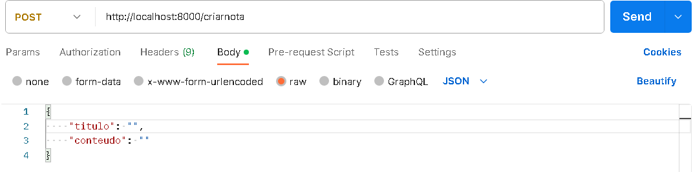
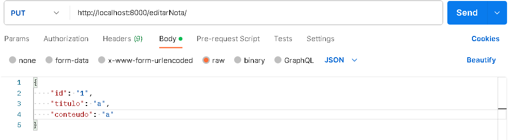

# API de Notas 📝

## Descrição

A **API de Notas** é uma api feita para criar notas, mostrar as notas criadas, editar as notas existentes e excluir as notas indesejadas. A estrutura da nota é titulo e conteudo.

## Tecnologias Utilizadas

## Recursos Principais

A API oferece as seguintes funções:

### 1. Criar uma Nota ✏️

O usuário pode criar uma nova nota enviando uma solicitação POST para o endpoint `/criarnota`. Deve ser fornecido um título e um conteúdo para a nota no corpo da solicitação em formato json.

Exemplo de solicitação:

### 2. Listar Notas 📋

Os usuários podem listar todas as notas existentes enviando uma solicitação GET para o endpoint `/listarnotas`.

Exemplo de solicitação para listar todas as notas:

### 3. Recuperar uma Nota ✍️

O usuário pode recuperar uma nota específica enviando uma solicitação GET com o ID da nota desejada para o endpoint `/recuperarnotas/:idNota`.

Exemplo de solicitação para recuperar uma nota pelo ID:

### 4. Atualizar uma Nota 🔄

O usuário pode atualizar o título e/ou o conteúdo de uma nota existente enviando uma solicitação PUT com o ID da nota para o endpoint `/editarNota`. Eles devem fornecer os novos dados da nota no corpo da solicitação.

Exemplo de solicitação para atualizar uma nota pelo ID:

### 5. Excluir uma Nota ❌

Os usuários podem excluir uma nota enviando uma solicitação DELETE com o ID da nota para o endpoint `/excluirNota/:idNota`.

Exemplo de solicitação para excluir uma nota pelo ID:

## Autor

https://github.com/gabrielmdss

## Licença

https://github.com/gabrielmdss
